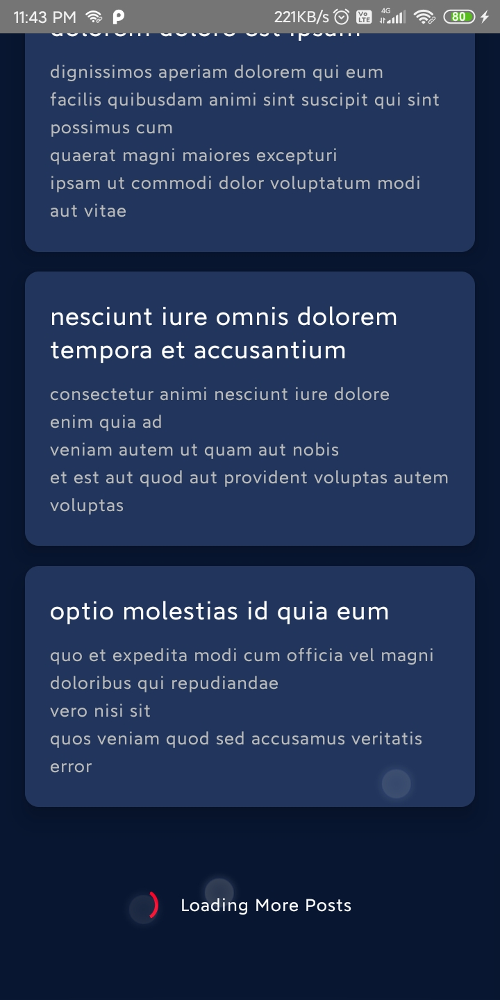
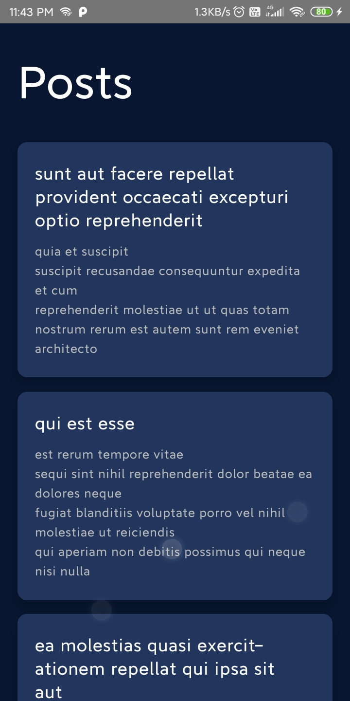

# TDG

This app calls the REST API and displays post with pagination. `FlatList`is used to demostrate lazy loading. `react-native-paper` is used for UI design.

APK can be downloaded from [here](/android/app/build/outputs/apk/release/app-release.apk)

### Screenshots

